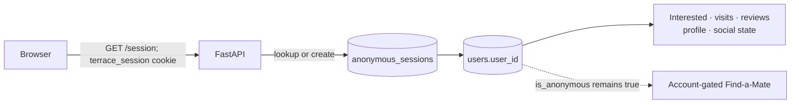
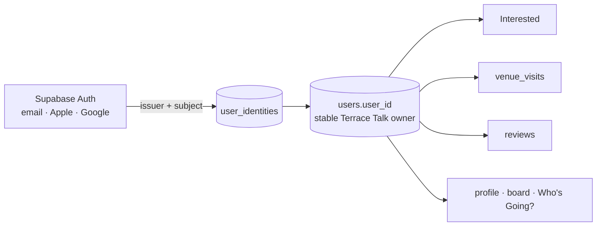

# Phase 4 authentication and identity assessment

> **Assessment snapshot — 18 August 2026.** This document records the decision and original phased plan. Phase 4A, Phase 4B and the backend-only Phase 4C new-account claim are now implemented. Signup/login UI, live-provider configuration, existing-account merge and registered-only social enforcement are not live. See [Identity and social architecture](identity-and-social.md) for current status.

## Recommendation

Use **Supabase Auth as a standalone managed identity provider**, keep FastAPI as the authoritative API, and keep the existing integer `users.user_id` as Terrace Talk's permanent ownership key. Map provider identities to that key through a small `user_identities` table. Web and future mobile clients should obtain provider access tokens and send them directly to FastAPI; FastAPI should validate their signatures and claims and then resolve the internal user.

Do not move application ownership to a provider UUID, put authorization only in Next.js, or build password handling in Terrace Talk. Do not replace the existing anonymous identity immediately. Introduce managed identity alongside it, then prove claim and merge behavior before tightening social permissions.

Supabase Auth supports password, passwordless email, social OAuth, standalone use, JWTs, native deep links and native identity linking. It is also open source/self-hostable, which reduces—though does not eliminate—provider lock-in. Its own anonymous-user feature is **not required for the first migration**: Terrace Talk should initially preserve its proven `terrace_session` → internal-user flow and use Supabase only when a supporter registers or signs in.

## 1. Current identity lifecycle



1. The shared Axios client calls FastAPI directly, dynamically using the browser hostname and port `8000`, with credentials enabled.
2. `GET /session` reads the HttpOnly `terrace_session` cookie. A valid opaque `session_id` resolves through `anonymous_sessions` to `users.user_id`.
3. Missing or invalid cookies create a new `users` row with `is_anonymous=true`, then a new session row and one-year cookie.
4. The cookie is currently `HttpOnly`, `SameSite=Lax`, `Secure=false`; the database session has no expiry, revocation or last-used fields. The opaque token is stored directly rather than as a hash.
5. Most owner-sensitive handlers independently resolve the cookie. `_session_user_id()` is used by newer visit/profile/social paths, while older Interested and review handlers duplicate session lookup.
6. Ownership authorization is enforced in FastAPI with the resolved internal ID. Review and visit queries constrain by `user_id`; Match Board deletion checks `author_user_id == current user`; reports prevent self-reporting and duplicates.
7. `user_profiles` are lightweight display profiles, not accounts. Creating one does not authenticate the supporter or set `users.is_anonymous=false`.
8. Enabling `fixture_meeting_intents` checks `users.is_anonymous` and requires a profile. Match Board posting currently requires only a session plus profile, so an anonymous supporter with a profile can post during development.
9. The frontend explicitly establishes `/session` before several personal/social flows. There is no login, refresh-token, account recovery or cross-device identity flow.

Important gaps discovered:

- `matchday_tips` has **no author/user ownership field**. Tips therefore cannot currently survive an account merge *as owned content*, show an author, or support “delete my tip.” Existing tips can remain anonymous historical content, but Phase 4 needs an explicit provenance decision before new account-attributed tips ship.
- Match Board writes are profile-gated rather than registered-account-gated.
- Session resolution is duplicated and should be consolidated before dual anonymous/authenticated modes are introduced.
- `GET /fixtures/{id}/social` records view events and commits even for read requests. This is existing analytics behavior, but authentication work should not mistake all GETs for mutation-free operations.

## 2. Current user-owned data inventory

The live PostgreSQL schema was inspected read-only. The following is the complete set of public tables whose columns contain `user_id` (including prefixed forms), plus the ownership-adjacent tips exception.

| Table | Ownership field | Current foreign key | Anonymous support | Account/merge impact and collision constraints |
|---|---|---|---|---|
| `users` | `user_id` | Primary owner key | Yes; every browser session creates/resolves one | New account should upgrade this row in place. Existing-account sign-in requires merging A into B. |
| `anonymous_sessions` | `user_id` | `users.user_id` | Yes; core session mechanism | New-account claim can retain/rotate the session temporarily. Merge must revoke A's sessions after commit. No unique constraint on `user_id`. |
| `interested_fixtures` | `user_id` | `users.user_id` | Yes | Deduplicate on unique `(user_id, fixture_id)`; keep one earliest/valid row. |
| `venue_visits` | `user_id` | `users.user_id` | Yes | Partial unique indexes enforce one `(user, fixture)` attendance, one dated `(user, venue, visit_date)` manual visit, and one undated `(user, venue)` visit. Merge exact duplicates; preserve distinct repeat visits. |
| `away_day_reviews` | `user_id` | `users.user_id` | Yes | Unique `(user_id, venue_id)`. Never create two opinions; conflict needs an explicit review rule. |
| `user_profiles` | `user_id` | `users.user_id`, also primary key | Yes; currently just a lightweight profile | A and B can both have profiles. Registered B should normally win, with explicit fill-empty-fields behavior rather than blind overwrite. |
| `fixture_meeting_intents` | `user_id` | `user_profiles.user_id` and composite FK to Interested | Legacy/non-anonymous only through current API gate | Unique/PK `(user_id, fixture_id)`. Union intents after Interested is merged; preserve dependency. |
| `match_board_posts` | `author_user_id` | `user_profiles.user_id` | Currently yes if anonymous profile exists | Reassign A-authored posts to B. No ownership uniqueness conflict. `ON DELETE RESTRICT` prevents discarding authors. |
| `match_board_reports` | `reporter_user_id` | `user_profiles.user_id` | Currently yes if anonymous profile exists | Deduplicate unique `(reporter_user_id, post_id)` and discard reports against the user's own post if reassignment creates that state. |
| `social_events` | nullable `user_id` | `users.user_id`, `ON DELETE SET NULL` | Yes, plus anonymous/public views | Reassign attributable A events to B or deliberately retain as analytics history; no uniqueness conflict. |
| `matchday_tips` | **none** | None to users | Functionally anonymous only | Cannot migrate ownership. Add nullable author provenance before account-owned tip moderation; keep legacy rows authorless. |

The live constraints matched the SQLAlchemy models for the ownership rules above. One introspection caveat is that information-schema output repeats columns for the composite meeting-intent foreign key; the actual relationship is `(user_id, fixture_id)` → Interested, plus `user_id` → Profile.

## 3. Provider comparison

Scores are relative for Terrace Talk: 5 is strongest/lowest burden, 1 is weakest/highest burden. Pricing is a dated MVP-scale assessment and must be rechecked before procurement.

| Criterion | Clerk | Supabase Auth | Auth.js | Custom PostgreSQL auth |
|---|:---:|:---:|:---:|:---:|
| Next.js integration | 5 | 4 | 5 | 2 |
| FastAPI integration | 4 | 4 | 2 | 5 |
| Existing PostgreSQL fit | 3 | 5 | 4 | 5 |
| Native/mobile clients | 5 | 5 | 2 | 3 |
| Anonymous → registered support | 4 | 5 | 3 | 5 |
| Email/password | 5 | 5 | 2 | 1 |
| Passwordless/social login | 5 | 5 | 4 | 1 |
| Reset and email verification | 5 | 5 | 3 | 1 |
| Session security/rotation | 5 | 5 | 3 | 1 |
| Backend token validation | 5 | 5 | 2 | 4 |
| MVP implementation simplicity | 5 | 4 | 3 | 1 |
| Low vendor lock-in | 2 | 4 | 5 | 5 |
| MVP/beta cost | 4 | 5 | 5 | 3 |
| Scalability | 5 | 5 | 4 | 3 |
| Low ongoing developer burden | 5 | 5 | 3 | 1 |
| Low migration risk here | 4 | 5 | 2 | 2 |

### Assessment by option

- **Clerk:** the fastest polished Next.js UI and strong native/Python support. FastAPI can verify short-lived tokens using public keys, and Expo/native SDKs are mature. Its external user model, hosted UI conventions and pricing create greater product/provider coupling. Current published pricing is free for 50,000 monthly retained users, then paid per retained user on Pro.
- **Supabase Auth — recommended:** works as a standalone JWT issuer, supports password, magic link/OTP, Apple/Google and other OAuth providers, has native-client/deep-link guidance, identity linking, and public JWKS validation. It aligns naturally with PostgreSQL without requiring Terrace Talk to move application tables or expose them through Supabase. Published pricing currently includes 50,000 MAU free and 100,000 on Pro before per-MAU overage. Self-hostability and standards-based tokens improve exit options.
- **Auth.js:** strong for a web application whose auth authority lives in Next.js, but Terrace Talk's authoritative backend is FastAPI and future clients must call it directly. A secure FastAPI token bridge, issuer/JWKS strategy, mobile OAuth flow and non-Next clients would become Terrace Talk's responsibility. The Auth.js repository now recommends new projects consider Better Auth, increasing selection uncertainty. It is not the simplest system boundary here.
- **Custom PostgreSQL authentication:** gives full control and fits internal IDs, but shifts password hashing, verification emails, resets, OAuth, abuse protection, token rotation, recovery and future MFA onto this small product. The ownership merge is not the difficult part; operating a secure identity provider is. Reject for Phase 4.

Primary references: [Supabase Auth](https://supabase.com/docs/guides/auth), [anonymous users](https://supabase.com/docs/guides/auth/auth-anonymous), [identity linking](https://supabase.com/docs/guides/auth/auth-identity-linking), [JWT signing keys](https://supabase.com/docs/guides/auth/signing-keys), [native deep links](https://supabase.com/docs/guides/auth/native-mobile-deep-linking), [Supabase pricing](https://supabase.com/pricing), [Clerk token verification](https://clerk.com/docs/guides/sessions/manual-jwt-verification), [Clerk native mobile](https://clerk.com/docs/reference/native-mobile/overview), [Clerk pricing](https://clerk.com/pricing), and [Auth.js repository status](https://github.com/nextauthjs/next-auth).

## 4. Proposed internal/external identity model

Preserve `users.user_id`. Add provider data separately rather than putting one provider's subject directly on every application row.



Phase 4A implemented this transitional shape:

```text
user_identities
  user_identity_id   bigint primary key
  user_id            integer not null references users(user_id)
  issuer             text not null
  subject            text not null
  email              text nullable
  email_verified_at  timestamptz nullable
  created_at         timestamptz not null
  last_seen_at       timestamptz nullable
  unique (issuer, subject)
```

Use `issuer + subject`, not email, as the security key. Email can change and should never drive an automatic Terrace Talk ownership merge. A separate mapping supports Apple, Google, email/password, identity linking, and a future provider migration without changing owned tables. For MVP, normally allow one managed-auth subject per internal user; do not build a general identity platform until multi-provider account linking is needed.

Keep `users.is_anonymous` during transition, add an explicit account status later (`active`, `suspended`, `deleted`) and treat “has a verified mapped identity” as the authoritative registered condition. Avoid duplicating all provider metadata. Store normalized email only if Terrace Talk needs support/admin lookup or transactional communications; otherwise fetch it from the provider server-side. Never expose it as profile data.

## 5. Claim and merge flows

### New account: upgrade A in place

1. Browser has anonymous `terrace_session` resolving to internal user A.
2. Supporter completes Supabase signup and verification.
3. Client sends the valid provider access token to a dedicated FastAPI claim endpoint while also presenting the anonymous cookie.
4. FastAPI validates token signature, algorithm, issuer, audience, expiry and subject using cached provider JWKS.
5. In one database transaction, lock A and the identity key. Confirm the identity is not mapped, insert `user_identities → A`, mark A registered, and rotate/revoke A's anonymous session as policy requires.
6. Return authenticated internal-user state. Every owned row already points to A, so **no activity migration occurs**.
7. Subsequent web or mobile requests present provider tokens and resolve to the same A.

This upgrade-in-place flow is directly compatible with the current schema and is the safest path.

### Existing account: controlled A → B merge

Signing into an identity already mapped to B is a different operation and must not silently overwrite either user. After token verification, show a clear “add this device's Terrace Talk activity to your account” confirmation. Execute a server-side, retryable transaction with both users locked in deterministic ID order, a merge audit record/idempotency key, conflict resolution, ownership reassignment and only then session revocation. B remains the canonical account; A is marked merged/tombstoned, not immediately deleted.

Recommended collision rules:

| Data | Resolution |
|---|---|
| Interested | Set union by fixture; keep one row. |
| Fixture attendance | Set union by fixture; keep canonical existing B row, fill missing safe metadata from A. |
| Manual dated visits | Deduplicate exact venue/date collisions; preserve distinct dates as repeat visits. |
| Undated manual visit | Keep at most one per venue; never use it to erase dated visits. |
| Reviews | Never combine numeric scores. If only one is completed, keep it; if both contain content, require an explicit user choice or retain B and quarantine A for recovery. |
| Profiles | Keep B; optionally fill only blank optional fields from A. Never overwrite username/display name silently. |
| Who's Going? intents | Union after Interested rows exist. |
| Board posts/replies | Reassign authorship to B while preserving post IDs, threads and timestamps. |
| Reports | Deduplicate reporter/post pairs; remove newly self-directed reports. |
| Social events | Reassign for continuity or retain pseudonymous analytics according to the privacy policy. |
| Tips | No ownership can be merged until tip provenance exists. |

Dry-run the merge first and return a conflict summary. Failed merges must roll back completely. Retain an administrative audit trail that identifies A, B, actor, outcome and counts without copying content or tokens into logs.

## 6. FastAPI authorization and client sessions

FastAPI must own `current_user` resolution and all permission decisions.

- **Registered requests:** accept `Authorization: Bearer <provider access token>`. Validate locally against cached JWKS with an allowlisted algorithm, exact issuer/audience, expiry/not-before, and subject. Resolve `(issuer, subject)` to internal `users.user_id`, then load account status. Reject unmapped, suspended or invalid identities.
- **Anonymous web requests:** continue accepting `terrace_session` during migration. Resolve it to an anonymous internal user exactly as today, then progressively consolidate the helper and harden expiry, hashing, rotation and secure-cookie settings.
- **Precedence:** if both credentials are supplied, validate the bearer token first. Never let an anonymous cookie override an authenticated identity. Use the cookie only as a claim/merge candidate at explicit endpoints.
- **Web:** the browser obtains/refreshes the managed-auth session. Cross-origin browser-to-FastAPI calls attach a bearer token; production CORS must allow only known origins. An HttpOnly same-origin/BFF cookie could later reduce browser token exposure, but must not become the only API architecture.
- **Mobile:** native clients store refresh/session material in platform secure storage, obtain short-lived access tokens, and call FastAPI directly with the same bearer contract. OAuth/passwordless callbacks use universal/app links.

Avoid requiring calls to pass through Next.js. Avoid trusting client-supplied internal user IDs, email addresses or “registered” flags. Provider webhooks may synchronize lifecycle state, but request authorization should depend on a validated token plus the internal mapping, not on webhook timing alone.

## 7. Minimum Phase 4 profile

Keep authentication identity and public football identity separate.

- Unique, case-insensitive `username` (with reserved-word and abuse controls).
- `display_name`.
- Optional `supported_club`/home club.
- Optional broad location—city/region only, not precise coordinates by default.
- Optional short bio.
- Existing visit-derived ground counts; never manually maintained profile counters.

Email belongs primarily to the managed authentication identity. A normalized, verified copy may exist privately on `users` or `user_identities` only if required for support, notification preferences or provider migration. It must not be the public identity or the merge key.

## 8. Who's Going? terminology scope

Phase 4 should replace user-facing “Find a Mate”, “Find a mate”, and “Looking for a mate” with **WHO'S GOING?** and context-appropriate supporting copy. Current occurrences are in:

- `frontend/app/fixture/[fixtureId]/page.tsx`: action, state, count and error copy.
- `frontend/app/components/InterestedTab.tsx`: action/state/error copy.
- `frontend/app/components/NearbyFixtureCarousel.tsx`: count label.
- `frontend/app/components/AccountConversionPrompt.tsx`: account prompt heading.
- `frontend/app/components/ProfilePrompt.tsx`: profile-gate copy.
- Canonical docs: `architecture.md`, `identity-and-social.md`, `mvp.md`, and `supporter-journey-qa.md`.
- Backend user-facing 403 detail in `PUT /fixtures/{fixture_id}/open-to-meet`.

Keep `open_to_meet`, `FixtureMeetingIntent`, `/open-to-meet`, event names and database columns for now. They express an internal capability and renaming them adds migration/API risk without user value. Update API error text because it is displayed to users.

## 9. Match Board and minimum beta safety

Persistent accounts should make posts attributable to the same internal user while rendering public username/display name from the profile. Existing post IDs, soft deletion, thread structure, ownership checks and report history remain stable. Legacy posts can stay attached to their current internal owners; posts by users who never claim an account remain safely displayable under their historical profile or an explicit former/anonymous-supporter label. Do not attach them based on matching display names.

Before an external closed beta, provide at minimum:

- Registered-only creation for Who's Going?, posts, replies, reports and new attributed tips; anonymous reading can remain.
- Delete-own-content for posts and attributed tips, with soft-delete/audit semantics where community context matters.
- Report Match Board post and report tip with duplicate/rate-limit controls and a small moderator queue.
- `active`, `suspended` and `deleted` account states enforced centrally in FastAPI.
- Username normalization, uniqueness, reserved names, profanity/impersonation handling and change throttling.
- Posting/reporting rate limits and basic spam controls keyed to account plus IP/device signals proportionately.
- Moderator actions with reason, actor, timestamp and reversible suspension where practical.
- Privacy-safe logs, account export/deletion policy, and a support path for lost access/merge disputes.

Blocking, DMs, followers and friends are not Phase 4 prerequisites.

## 10. Proposed phased delivery

1. **4A — contract and schema foundation:** approve provider; threat-model claim/merge; add identity mapping, account state and merge-audit schema; add tip authorship decision. No permission cutover.
2. **4B — backend dual identity:** centralize `current_user`; validate provider bearer tokens; retain anonymous-cookie fallback; add account-status enforcement and auth observability without logging tokens/PII.
3. **4C — claim in place:** implement and test new-account A-in-place conversion, session rotation, idempotency and rollback.
4. **4D — existing-account merge:** implement dry-run, explicit consent, table-specific conflict handling, audit and recovery tooling before exposing sign-in to anonymous users with data.
5. **4E — web account UX:** signup/sign-in/verification/reset, minimal profile, account status, truthful errors and parallel anonymous journeys.
6. **4F — social cutover:** rename user-facing language to Who's Going?; require persistent accounts for intent and Match Board writes; add tip provenance and minimum moderation.
7. **4G — mobile-contract QA:** validate direct bearer-token calls, refresh, deep links, logout/revocation and account claim from the intended native stack.
8. **4H — hardening/legacy cleanup:** production secure-cookie/session policy, cleanup of abandoned anonymous rows under a retention policy, operational runbooks and rollback rehearsal. Do not remove anonymous support until metrics and regression QA prove both journeys.

Compatibility feature flags should independently control provider-token acceptance, account UI, claiming, merging and registered-only social writes. Rollback should disable new entry points while leaving mappings and existing ownership intact; never “roll back” by unlinking successfully claimed users or moving their data back.

## 11. Key risks and open approvals

Key risks:

- Incorrect A/B merge logic can silently lose or duplicate personal football history.
- Review conflicts need a product decision because two subjective score sets cannot be safely auto-merged.
- Tips currently lack ownership, preventing complete account migration and own-content moderation.
- Current long-lived development cookies need production hardening, but changing them prematurely could disrupt anonymous QA.
- Automatic provider email linking and Terrace Talk account merging are different trust decisions; relying on email alone risks account takeover.
- JWT key caching, key rotation, logout/revocation latency and clock skew require explicit tests.
- Cross-origin browser tokens increase XSS/CORS design importance; a web BFF may improve defense-in-depth without becoming mandatory for mobile.
- Provider pricing and product capabilities can change; reassess before contract and launch.

Product/technical approvals required before implementation:

1. Approve Supabase Auth and initial methods—recommended: verified email magic link/OTP plus Apple and Google, with password optional rather than mandatory.
2. Decide whether conflicting completed reviews require user choice or default to registered-account B.
3. Decide whether account merge is prompted automatically after existing-account sign-in or offered as a separate explicit claim action.
4. Decide how legacy authorless tips are displayed and whether new tips require accounts.
5. Approve public username requirements, change policy and moderation vocabulary.
6. Approve anonymous-session retention and eventual cleanup periods.
7. Decide whether web uses direct bearer tokens initially or a same-origin token/BFF layer for additional browser isolation; mobile must remain direct-to-FastAPI.

## Validation record

- Inspected current SQLAlchemy models, FastAPI handlers, schemas, shared Axios client, frontend account/session gates and canonical documentation.
- Inspected live PostgreSQL ownership columns, foreign keys and unique constraints using read-only information-schema queries inside a rolled-back transaction.
- No auth package was installed, provider project created, schema changed, migration created/executed, cookie changed or application file modified.
- The database inspection issued no writes and explicitly rolled back its transaction.
