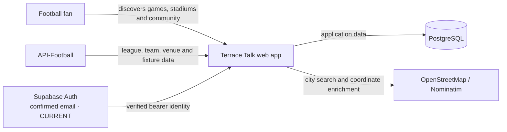
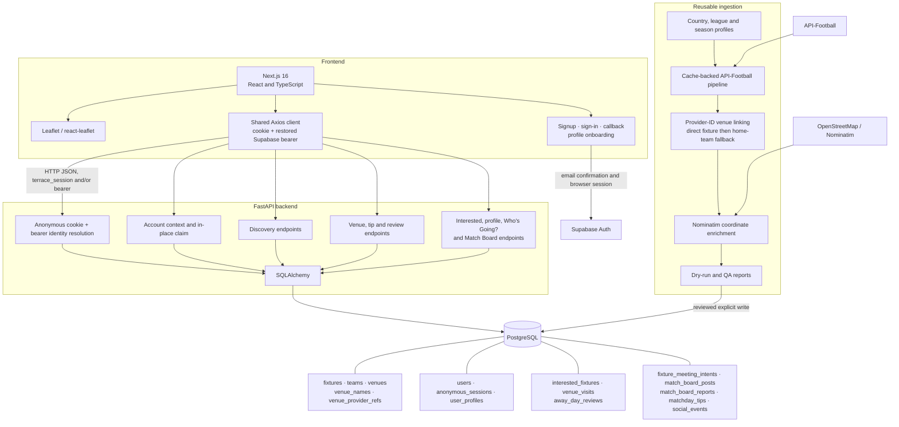
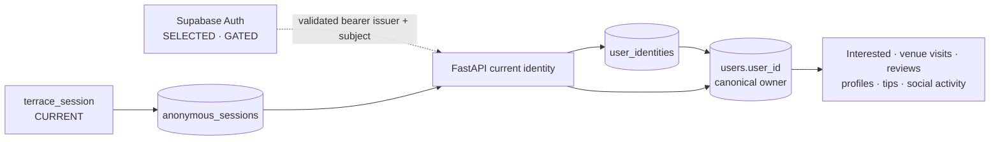

# Terrace Talk architecture

**Canonical current architecture — 19 August 2026.** Future items are labelled explicitly.

## System context

Terrace Talk helps football fans find games to attend and understand the stadium experience. PostgreSQL, rather than a provider response, is the application source of truth.

## Containers and data flow

## Current frontend routes

| Route | Current purpose |
|---|---|
| `/` | Coordinate-based fixture discovery, filters, map, nearby carousel and Interested actions |
| `/venue/[venueId]` | Stadium details, ratings, tips, upcoming fixtures, Visited/review state and Interested |
| `/fixture/[fixtureId]` | Fixture social detail, Interested, Who's Going? and Match Board |
| `/my-football` | Interested and Visited/My Stadiums tabs |
| `/my-stadiums` | Redirect into `/my-football?tab=visited` |
| `/interested` | Redirect into `/my-football?tab=interested` |
| `/signup` | Email account creation and confirmation handoff |
| `/signin` | Existing-account email sign-in |
| `/auth/callback` | Supabase confirmation return and automatic claim orchestration |
| `/account/onboarding` | Minimum registered profile setup |
| `/account/ready` | Successful in-place conversion confirmation |
| `/account/conflict` | Safe Phase 4D holding state when device activity cannot yet be merged |

`GET /leagues` returns database-derived country groups containing league IDs and names. Countries are alphabetical; leagues retain provider-ID order within each country. The frontend renders these groups without maintaining a separate country/league map and sends zero or more selected stable league IDs to discovery filtering.

## Architecture principles

**Stadium identity is stable; venue names and provider references may change over time.**

- PostgreSQL is Terrace Talk's application source of truth.
- API-Football is the first data provider, not the application data model; canonical internal relationships remain provider-independent.
- Provider IDs are preferred for fixture, team and venue linking. A fixture's direct provider venue ID is authoritative; its home-team provider venue is an inferred fallback.
- A physical stadium has one stable `venues.venue_id`. `venues.name` is its current display name, `venue_names` stores searchable current and reviewed historical names, and `venue_provider_refs` maps provider identities without changing ownership.
- A trusted name change on the same provider reference updates the display name and retains the previous name. A new provider ID is never fuzzy-merged; probable duplicates are review candidates.
- Reviewed manual overrides are exceptional, narrowly scoped fallbacks. They never outrank direct provider fixture data.
- `users.user_id` is the stable ownership identity. Anonymous activity must survive future account conversion.
- Current-device and searched locations write to the same discovery coordinate state, while remaining separate user actions.
- The map defaults to fixture-focused discovery. **Show all stadiums** is optional and defaults off.
- Explicit location discovery uses a centre coordinate plus the supporter's selected radius. After manual map movement, **Search This Area** switches discovery to the live Leaflet viewport bounds (`north`, `south`, `east`, `west`) while retaining dates and league IDs. Viewport mode filters linked venue coordinates directly, does not use radius for exclusion, and returns total/limited result headers under a safe cap.
- Business invariants belong in the backend and database; frontend state follows authoritative API responses.

## Current and approved future architecture

### Phase 4 transitional identity foundation

Supabase Auth is selected. FastAPI has feature-gated bearer verification and the Phase 4C `POST /account/claim` backend path. Phase 4C.5 live-tested ES256/JWKS verification, confirmed-email claiming, bearer resolution, session revocation and conflict detection. Phase 4E adds product email signup, confirmation, sign-in, automatic claim, minimum profile onboarding, session restoration and logout. Identity linking and account merging are **not implemented**.

Phase 4A adds the identity contract without changing runtime authorization:

- `user_identities` maps trusted `(issuer, subject)` values to the permanent internal `users.user_id`; email is metadata, never the secure mapping key.
- `users.account_status`, `registered_at` and `merged_into_user_id` prepare lifecycle and merge state while preserving `is_anonymous` for compatibility.
- `user_profiles.username` is nullable with case-insensitive uniqueness when present. `supported_club` remains the current home-club field; `broad_location` and `bio` are optional.
- `matchday_tips.author_user_id` is nullable, preserving historical unowned tips while allowing future attribution.
- `account_merge_audits` can record a future completed merge. No merge algorithm exists yet.
- Multiple external identities may eventually map to one internal user; only `(issuer, subject)` is unique.

Phase 4B centralizes runtime identity resolution in FastAPI:

- A valid mapped bearer identity takes precedence over `terrace_session`; the two owners are never combined automatically.
- A present malformed, expired, wrongly signed, wrong-issuer or wrong-audience bearer request is rejected and never falls back to the cookie.
- A valid but unmapped provider identity returns `403 IDENTITY_NOT_LINKED`, because provider authentication succeeded but Terrace Talk ownership authorization did not.
- `account_status` is authoritative. `is_anonymous` is compatibility-only and drift is logged without exposing tokens, cookies, email or JWT payloads.
- Bearer verification is enabled only by `SUPABASE_AUTH_ENABLED=true` with complete issuer, audience and JWKS configuration. JWKS keys are cached with bounded network timeouts and refresh on rotation/key miss.
- Browser and future native clients use the same `Authorization: Bearer <access token>` contract directly with FastAPI; Next.js is not an authentication gateway.

Phase 4C implements new-account in-place claiming:

- `POST /account/claim` requires the current anonymous HttpOnly cookie and a verified, permanent Supabase bearer identity.
- In one transaction it locks the session and A, serializes `(issuer, subject)` claims, maps that identity to the same A, marks A registered and revokes the anonymous session.
- No Interested, visit, review, profile, post, report, meeting-intent, social-event or attributed-tip ownership row is rewritten.
- Same-A retries are idempotent. An identity mapped to B returns `409 IDENTITY_ALREADY_LINKED`; no A-to-B merge exists.
- Full profile completion is not required; the response reports whether username and display name exist.
- Development-project validation preserved the same internal user and every representative owned record. A second anonymous user's cookie remained subordinate to the mapped bearer, while claim correctly returned `409` and performed no merge.

Phase 4E provides product account orchestration:

- A reusable browser Supabase client restores and refreshes provider sessions; Axios supplies the access token to FastAPI, which remains authoritative.
- Signup establishes the anonymous Terrace Talk owner, requires email confirmation and returns through a safe internal callback.
- An unmapped confirmed identity claims that owner automatically; supporters never handle identity-linking terminology.
- `GET /account/context` distinguishes an empty anonymous shell from meaningful device activity when an existing account signs in. Meaningful activity produces a Phase 4D holding screen; nothing is merged or discarded.
- Minimum onboarding updates the existing profile with username, display name and optional club/location/bio. Username uniqueness remains case-insensitive in PostgreSQL.

### Current

- A long-lived `terrace_session` cookie maps to an anonymous `users.user_id`.
- `user_profiles` provide canonical public attribution for registered social writes. They contain username/display metadata, not provider credentials or account identity.
- Anonymous users can use discovery, Interested, My Stadiums/reviews and read the Match Board.
- Who's Going? is account-gated in the UI and API; Interested remains available anonymously. Internal `open_to_meet` names are unchanged.
- Match Board reading is anonymous. Posting, deleting one's own post and reporting another author's post require a resolved registered identity and complete Terrace Talk profile.
- `/signup`, `/signin` and `/auth/callback` provide confirmed-email account access and in-place conversion. `/auth-test` remains development-only and returns not-found in production.
- `venue_visits` is the backend source for repeat attendance/history. `POST /fixtures/{fixture_id}/attendance` records fixture attendance, `POST /venues/{venue_id}/visits` records manual visits, and `GET /my-grounds` derives a ground summary from visits while joining the user's optional review.
- Fixture social responses expose the current user's attendance state. Attendance writes are idempotent under the database uniqueness rules, and legacy review creation also ensures a matching visit during the transition.
- My Grounds membership, venue visited state, homepage/map visited markers and fixture attendance now derive from `venue_visits`. My Matchdays reads fixture-linked visits for attended-match history, and profile `grounds_visited` counts distinct visited venue IDs.
- Reviews remain one optional opinion per user and venue in `away_day_reviews`. The legacy review columns and blank migrated rows remain during the retirement transition, but they no longer define whether a ground was visited.

### Approved future

- Existing-account A-to-B merge and general identity linking remain future work.
- Managed passwordless email and/or OAuth is preferred over custom password storage.
- Authenticated sessions will support cross-device Interested, My Stadiums, reviews, profile and social activity.
- Phase 4F registered-only social writing is implemented. Existing-account merge/linking and broader moderation remain future work.
- Production authentication needs secure cookies, rotation/revocation, account recovery/provider flows and an explicit anonymous-data merge policy.

See [Identity and social](identity-and-social.md) for the ownership and permission model.
