# Data ingestion playbook

This is the canonical import guide. `ingest_leagues.py` is the main API-Football entry point and is read-only unless both `--write` and `--confirm-write` are supplied.

## Flow

```mermaid
flowchart LR
    Config[Country / league / season profile] --> Cache[Cached API-Football responses]
    AF[API-Football] --> Cache
    Cache --> Teams[Upsert teams]
    Teams --> Refs[Resolve venue_provider_refs]
    Refs --> Venues[Upsert stable canonical venue]
    Venues --> Fixtures[Upsert fixtures]
    Fixtures --> Link{Venue link}
    Link -->|1. direct fixture provider venue| Direct[Authoritative link]
    Link -->|2. home-team provider venue| Home[Inferred fallback]
    Link -->|3. no safe link| Unresolved[Unresolved / reviewed exception]
    Direct --> Coords[Coordinate validation]
    Home --> Coords
    Unresolved --> QA[QA report]
    Coords -->|missing only| Nom[Nominatim enrichment]
    Nom --> QA
    QA --> Dry[Dry-run review]
    Dry -->|explicit --write --confirm-write| DB[(PostgreSQL)]
```



## Configuration and safety

League profiles live in `config/leagues.py`. They specify country, provider league, provider season and display-season label; season is never inferred. Credentials belong in `backend/.env` or the process environment:

```text
DATABASE_URL=...
API_FOOTBALL_KEY=...
```

Do not commit values. Raw provider responses are cached in `.cache/api-football`; reports are written to `reports/ingestion`.

## Commands

Run from the repository root with the repository virtual environment.

### Profile dry runs

```powershell
.\.venv\Scripts\python.exe .\ingest_leagues.py --profile england-pyramid
.\.venv\Scripts\python.exe .\ingest_leagues.py --profile usa-priority
.\.venv\Scripts\python.exe .\ingest_leagues.py --profile sweden-priority
```

### One-league dry run and controlled write

```powershell
.\.venv\Scripts\python.exe .\ingest_leagues.py --country USA --league-id 253 --league-name "Major League Soccer" --season 2026 --display-season 2026
.\.venv\Scripts\python.exe .\ingest_leagues.py --country USA --league-id 253 --league-name "Major League Soccer" --season 2026 --display-season 2026 --write --confirm-write
```

Use `--no-geocode` when a reviewed write should apply cached accepted coordinates only and defer new Nominatim queries.

### Coordinate and active-API QA

```powershell
.\.venv\Scripts\python.exe -m ingestion.validate_mvp_data_quality
.\.venv\Scripts\python.exe -m ingestion.apply_reviewed_coordinates
.\.venv\Scripts\python.exe -m ingestion.apply_reviewed_coordinates --write --confirm-write
```

Reviewed manual exceptions use a narrow scoped command:

```powershell
.\.venv\Scripts\python.exe -m ingestion.apply_manual_venue_override --league-id <id> --season 2026 --home-team-id <id>
.\.venv\Scripts\python.exe -m ingestion.apply_manual_venue_override --league-id <id> --season 2026 --home-team-id <id> --write --confirm-write
```

## Linking and coordinate rules

1. A fixture's provider venue ID is authoritative.
2. The home team's provider venue is a fallback and must be reported as **inferred**, not authoritative.
3. A reviewed manual override is a future-proof exceptional fallback when provider evidence is absent; otherwise leave the fixture unresolved.

`venues.venue_id` is the stable internal identity. `venue_provider_refs` is authoritative for provider-to-canonical resolution and can hold multiple provider references for one venue. The legacy nullable, unique `venues.provider_venue_id` remains for API compatibility during migration. Never invent provider IDs.

For venue names:

1. A trusted name change on an existing provider reference updates `venues.name`, promotes that value to the single current `venue_names` row and retains the former value as historical.
2. A fixture name without a fixture provider venue ID is reported as an observed candidate. It cannot change a canonical venue name or create an alias automatically.
3. A previously unseen provider ID creates a new venue unless reviewed evidence explicitly maps it. Exact metadata similarities may be reported, but name similarity never triggers an automatic merge.

Reviewed aliases are searchable and return the canonical venue once. Fixture rows retain the provider-supplied `venue_name` field, while current discovery, map and venue-page display resolves through the linked canonical venue. Valid database coordinates are preserved, resolved venues are not repeatedly geocoded, and only explicitly accepted coordinate results may be applied.

Nominatim enrichment normalizes input and tries progressively broader stadium/address/city/country combinations with a named user agent and conservative request spacing. Wrong-city, ambiguous and insufficient candidates remain unresolved.

## Current coverage and dated findings

The 2026 profiles cover England, the USA priority leagues and Sweden. The England provider audit found availability through Step 7-equivalent premier divisions. The Sweden work includes an Allsvenskan audit and the available lower national groups. API-Football venue payloads frequently omit coordinates, which is why the generalized Nominatim and reviewed-coordinate path exists.

Some USA venues remain reviewed exceptions when direct or team provider data is incomplete. Never turn a dated unresolved count into a permanent invariant. The dated machine-readable snapshots under `reports/ingestion`, especially `mvp-data-quality-final-2026.json`, `mvp-coordinate-gaps-2026.json` and `unresolved-link-review-2026.json`, are the evidence for a specific import state.

## Import checklist

1. Confirm the database identity, league/provider season and cached response scope.
2. Run a dry run and review availability, inserts/updates, duplicate provider IDs and unresolved links.
3. Review inferred home-team links, direct/home conflicts and coordinate candidates.
4. Review `observed_venue_name_candidates` and `provider_reference_review_candidates`; neither list is an instruction to merge.
5. Run the explicit controlled write one league at a time.
6. Run database and active API QA, including `/leagues`, `/fixtures`, `/nearby`, `/venues` and venue search.
7. Preserve unresolved records for review; do not guess with fuzzy name matching.

Generate the current non-mutating renamed-stadium candidate report with:

```powershell
.\.venv\Scripts\python.exe .\audit_venue_identity_candidates.py --output .\reports\ingestion\venue-identity-review-candidates-2026-08-14.json
```

## Mutable fixture refresh

Full-season imports use cached provider responses for safe repeatability, so they are not the operational refresh for scores and statuses. During beta, run `refresh_fixture_states.py` at least daily over the recent-past/current/future window. It deliberately bypasses provider cache and updates only existing fixture kickoff, status, score and raw venue-label fields.

```powershell
.\backend\venv\Scripts\python.exe refresh_fixture_states.py --from-date 2026-08-13 --to-date 2026-10-19
.\backend\venv\Scripts\python.exe refresh_fixture_states.py --from-date 2026-08-13 --to-date 2026-10-19 --write --confirm-write
```

Review the dry-run report before the transactional write. Never infer `FT` from a past kickoff. The beta preflight fails past `NS` beyond the agreed grace window and future `FT`/`AET`/`PEN` rows.
