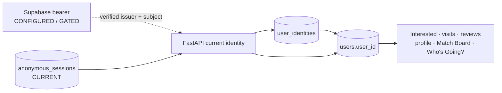
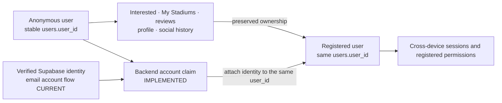
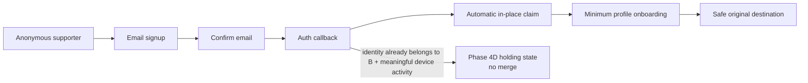

# Identity and social architecture

## Phase 4 transitional state

Supabase Auth has been selected. Phase 4A introduced the database contract, Phase 4B centralized FastAPI identity resolution, Phase 4C implemented in-place claim, and Phase 4C.5 validated it against the development provider. Phase 4E adds confirmed-email signup/sign-in, automatic claim, minimum profile onboarding, restored bearer sessions and logout. Existing-account merge is not implemented. Anonymous `terrace_session` behavior remains live until a successful claim.



Provider subjects attach through `user_identities`; email does not establish ownership. `POST /account/claim` now claims existing anonymous activity in place. Existing historical tips remain unchanged with `author_user_id=NULL`.

### Phase 4C claim sequence

```mermaid
sequenceDiagram
    participant Client
    participant Provider as Supabase Auth
    participant API as FastAPI
    participant DB as PostgreSQL
    Client->>API: POST /account/claim + bearer + terrace_session
    API->>Provider: Confirm current permanent provider user
    API->>DB: Lock session, user and provider identity key
    DB-->>API: Anonymous owner A is claimable
    API->>DB: Map issuer+subject to A; register A; revoke session
    DB-->>API: Commit atomically
    API-->>Client: same user_id A + profile_complete
```

The claim requires both credentials. FastAPI validates JWT signature, issuer, audience and expiry, then asks Supabase's authenticated user endpoint to confirm a matching, non-anonymous subject with a present and parseable `email_confirmed_at`/`confirmed_at`. Client-submitted email or verification flags are never trusted. Row locks, a provider-identity advisory lock and database uniqueness serialize claims. A same-A retry is idempotent; a mapping owned by B returns `409 IDENTITY_ALREADY_LINKED` and performs no merge.

On success, A's `users.user_id` and every owned row remain unchanged, while the account is marked registered, one `user_identities` row is added, and the claiming session receives `revoked_at`. The response expires the cookie; subsequent requests authenticate with the bearer. Profile completion means a nonblank username and display name and is reported, not required.

### Live-provider validation

The development project uses confirmed email authentication and an EC P-256 / ES256 signing key. Its public JWKS endpoint exposed the expected EC key, and a real confirmed Supabase session successfully claimed a disposable anonymous Terrace Talk user in place. The same bearer subsequently resolved that internal user through My Grounds, Interested, profile and fixture-social reads. A different anonymous cookie did not override the bearer, and attempting to claim that second anonymous user with the already-mapped identity returned `409 IDENTITY_ALREADY_LINKED` without revoking or changing the second user.

The one-time claim retains the provider `/user` call. Local JWT validation proves token authenticity, issuer, audience and subject; the authenticated provider response additionally supplies current permanent-user and confirmation state that is not part of Terrace Talk's required JWT claim contract. This extra network dependency is limited to claiming rather than ordinary authenticated requests.

The resolution contract is:

```text
valid mapped bearer > anonymous cookie
present invalid bearer -> 401, never cookie fallback
valid unmapped bearer -> 403 IDENTITY_NOT_LINKED
no identity on required endpoint -> 401
```

`account_status` is the source of truth. `is_anonymous` remains only for compatibility until a later migration. Suspended, merged and deleted identities are rejected centrally. The current anonymous session creation path remains available to `/session` and Interested.

New tips created with a resolved current identity record nullable `author_user_id`; existing historical tips remain unowned. This adds ownership continuity without changing tip permissions.

Internally, `open_to_meet`, `FixtureMeetingIntent` and the existing route names power the user-facing **Who's Going?** feature. These internals are intentionally unchanged in Phase 4A.

## Current identity

- `users.user_id` is the owner key for personal data.
- `anonymous_sessions` maps the long-lived HttpOnly `terrace_session` cookie to that user.
- `GET /session` reuses a valid session or creates an anonymous user/session.
- `user_profiles` contain a display name and optional supported club. A profile is **not** authentication or a registered account.
- `/signup`, `/signin` and `/auth/callback` now provide the product email account flow. Password handling and confirmation remain managed by Supabase; Terrace Talk never stores passwords.

Interested lives in `interested_fixtures`. `venue_visits` is the current source for My Grounds membership and repeat attendance/history, while `away_day_reviews` remains one optional opinion per user and venue. The visit backfill preserves the same `users.user_id` and canonical `venues.venue_id`. Legacy review creation still ensures a matching visit for compatibility. Who's Going? state lives internally in `fixture_meeting_intents`. Fixture posts, replies and reports live in the Match Board tables.

## Current visit and review API

- `POST /fixtures/{fixture_id}/attendance` idempotently records a fixture-linked visit using the fixture's canonical venue and date.
- `DELETE /fixtures/{fixture_id}/attendance` removes that fixture attendance only; it does not delete a venue review or other visits.
- `POST /venues/{venue_id}/visits` idempotently records a manual undated, dated or fixture-linked visit. A supplied fixture must belong to the route venue.
- `GET /my-grounds` groups visits by stable venue identity and returns visit count, first/latest known visit dates, undated status, attended fixtures, the user's optional review and existing community aggregates.
- Fixture social responses include the current user's fixture-attendance state.
- New read models classify an existing review as `blank`, `partial` or `completed`; absence is represented by no review. Completion requires recommendation plus all four category scores and the calculated overall score.

The frontend now consumes this visit model for My Grounds, venue/map visited state, completed-fixture attendance and attended Matchdays. Interested remains planning/social intent and is never proof of attendance. Review creation remains on the legacy endpoint until the compatibility columns and blank rows can be retired safely.

## Current social invariants

```text
Who's Going? → Interested
Remove Interested → remove Who's Going? intent
```

- Interested can create an anonymous session and does not require a profile or account.
- Anonymous Interested shows a dismissible account-conversion prompt after the save succeeds.
- Enabling Who's Going? requires a registered user at the API boundary. Anonymous supporters see Create account and Sign in actions; no intent is created before registration.
- Meeting updates are serialized per user, idempotent and return authoritative Interested, intent and aggregate count state.
- Removing Interested clears its Who's Going? intent. Phase 4F meeting-intent writes require a registered identity and complete canonical profile.
- Match Boards are fixture-specific, anonymously readable, registered-write-only, close when a fixture is completed or its match day has passed, and apply a posting cooldown.
- Registered authors may delete only their own posts. Registered supporters may report another author's active post once; anonymous, self and duplicate reports are rejected.

## Current permission model

| Capability | Anonymous now | Registered future |
|---|---:|---:|
| Discover fixtures and stadiums | Yes | Yes |
| View ratings, tips and Match Boards | Yes | Yes |
| Mark Interested | Yes | Yes, cross-device |
| Record attendance/visits through the backend API | Yes, browser-session identity | Yes, cross-device |
| Use My Stadiums and reviews | Yes, browser-session identity | Yes, cross-device |
| Enable Who's Going? | No | Yes |
| Post publicly on Match Board | No | Yes, with complete profile |
| Persistent account identity | No | Yes |

## Implemented new-account conversion and approved follow-on



New-account claiming attaches persistent identity to the current `users.user_id`; it does not create an unrelated owner or move owned rows. Phase 4E invokes this automatically after confirmation/sign-in, then requires username and display name. General identity linking and A-to-B existing-account merge remain future work. Phase 4F enforces registered-only Who's Going? and Match Board writes while preserving anonymous aggregate/board reads.

## Phase 4E product flow



The browser Supabase SDK owns provider-session persistence and refresh. A shared Axios interceptor adds the current access token to FastAPI requests; backend verification and internal-user resolution remain authoritative. Return destinations must be internal paths and are normalized before navigation.

`GET /account/context` is deliberately read-only. For an existing mapped account, it distinguishes a cookie with no activity from meaningful anonymous ownership across Interested, visits, reviews, profile, meeting intent, board ownership/reports and attributed tips. Read-only `SocialEvent` telemetry is incidental and does not trigger merge/conflict copy. Empty shells and fixture views therefore do not create alarming conflict copy. Meaningful owned activity is preserved and shown the conflict holding screen until Phase 4D exists.

Usernames are 3–30 ASCII letters, numbers or underscores, with case-insensitive uniqueness enforced by PostgreSQL. Display name is required; supported club, broad location and bio are optional. Reserved-name moderation remains required before broader public beta.

### Phase 4E live acceptance — 20 August 2026

The development Supabase project completed the product flow with a real confirmed-email identity. Anonymous user `339` was claimed in place, retained its existing Interested row for fixture `1564254`, completed one profile, enabled one Who's Going? intent, survived refresh/session restoration and retained both records after logout. The claim created one identity mapping and revoked the anonymous session; it created no duplicate ownership rows.

The existing-account case was also exercised: registered user `53` signed in while the device cookie owned meaningful activity for user `339`. `/account/conflict` rendered, both owners remained unchanged and no merge audit was created. A brief provider/backend clock difference exposed JWT `iat` validation; the verifier now permits at most 60 seconds for `iat`/`nbf` skew while keeping expiry strict and continuing to enforce signature, issuer and audience.

This acceptance proves the prepared Interested, profile and Who's Going? records used in the journey. Other ownership types remain covered by backend claim tests rather than being asserted as live rows for this particular user.

### Phase 4F live acceptance — 20 August 2026

Anonymous fixture access exposed only safe Who's Going? counts and readable Match Board posts. Meeting opt-in and board-post attempts opened the existing account flow with a safe fixture return path. Registered user `339` enabled Who's Going?, refreshed with the state preserved, created and refreshed a canonically attributed post, then deleted that same post. Completed fixture `1597287` remained readable and rejected a direct authenticated post with HTTP `409`.

The empty-board interface has one matchday-utility explanation and one composer; it does not introduce a second “start” action. The board exists for **KNOW → CONNECT**, not as a generic football forum. Acceptance-only post, intent and telemetry records were removed afterward and database counts reconciled exactly to the recorded baseline.

## Login and merge considerations

When a registered user logs in on a browser that already owns anonymous activity, the product needs an explicit transactional merge policy:

- Union Interested by fixture and avoid duplicate unique-key rows.
- Merge My Stadiums/reviews by venue, with an explicit conflict choice where both identities reviewed the same venue.
- Reconcile profiles rather than silently overwriting display data.
- Preserve only social intents permitted by registered-account policy.
- Reassign eligible ownership to the registered `user_id`, then rotate or revoke the anonymous session.
- Audit partial failures so data is never split silently across identities.

Future production authentication should use a managed passwordless email and/or OAuth provider, secure cookies, session rotation/revocation and account recovery rather than custom password storage.
